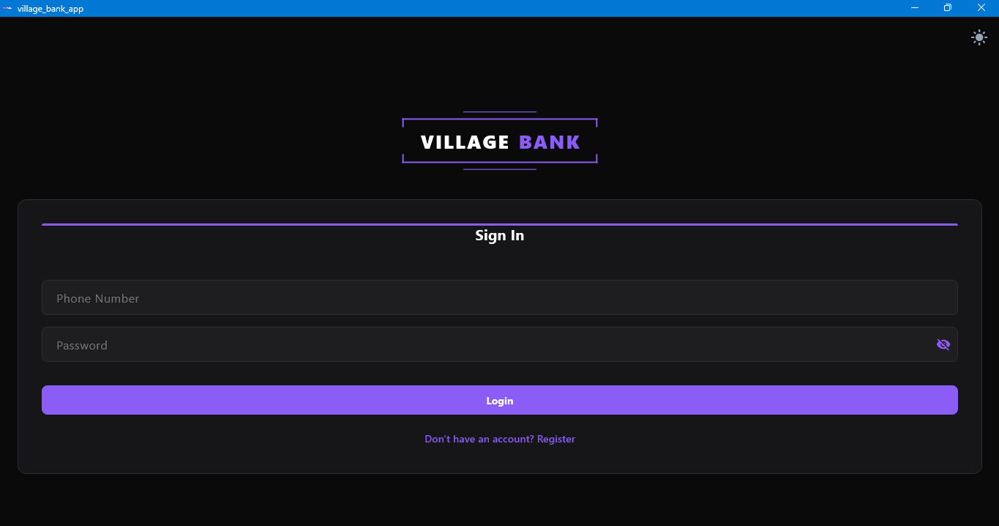

# 🏦 Village Bank App

A comprehensive full-stack mobile application built with **Flutter** and **Node.js** designed to facilitate community-based micro-finance (Village Banking). This platform allows members to save, borrow, and track their financial growth collectively.

## 🚀 Features

### For Members
- **Secure Authentication:** Easy login and registration via phone number.
- **Financial Summary:** Real-time view of savings, active loans, and accrued interest.
- **Transactions:** Full history of deposits and withdrawals.
- **Loan Management:** Request loans with automatic interest calculation (35%) and track repayments.
- **Instant Deposits/Payouts:** Submit deposit proofs and request payouts to mobile money accounts.
- **Built-in Chat:** Communicate with admins and other members via direct or group chat, including image sharing.
- **Real-time Notifications:** In-app notifications for transaction updates and admin messages.

### For Admins
- **Dashboard Overview:** Monitor total group funds, active loans, and total members.
- **Approval Workflow:** Verify and approve/reject deposits, loan requests, and repayments.
- **System Logs:** Transparent logging of all critical system activities.
- **User Management:** View all member details, including their individual financial standing.
- **Release Tracking:** Manage and log new application builds.

## 🛠️ Technology Stack

- **Frontend:** Flutter (Dart)
- **Backend:** Node.js (Express)
- **Database:** MongoDB (via Mongoose)
- **State Management:** Provider
- **Theming:** Custom Glassmorphic UI (Aurum Kit)

## 📁 Project Structure

```text
village_bank_app/
├── android/            # Android native code
├── backend/            # Node.js Server & API
│   ├── server.js       # Express server & MongoDB schemas
│   ├── .env            # Environment variables (DB URI, etc.)
│   └── package.json    # Backend dependencies
├── lib/                # Flutter Frontend code
│   ├── models/         # Data models
│   ├── screens/        # UI Screens (Auth, Dashboard, Chat, etc.)
│   ├── services/       # API & Notification services
│   └── widgets/        # Reusable UI components
├── ios/                # iOS native code
└── assets/             # Images and fonts
```

## ⚙️ Setup Instructions

### Backend
1. Navigate to the `backend/` directory.
2. Run `npm install` to install dependencies.
3. Create a `.env` file and add your `MONGODB_URI`.
4. Start the server: `node server.js`.

### Frontend
1. Ensure you have the Flutter SDK installed.
2. Run `flutter pub get` in the root directory.
3. Update the API base URL in `lib/services/api_service.dart` to point to your backend.
4. Run the app: `flutter run`.

## 📸 Screenshots

<p align="center">
  
  <br>
  <i>Secure Login Screen with Glassmorphic UI</i>
</p>

---

Developed with ❤️ for community finance.
